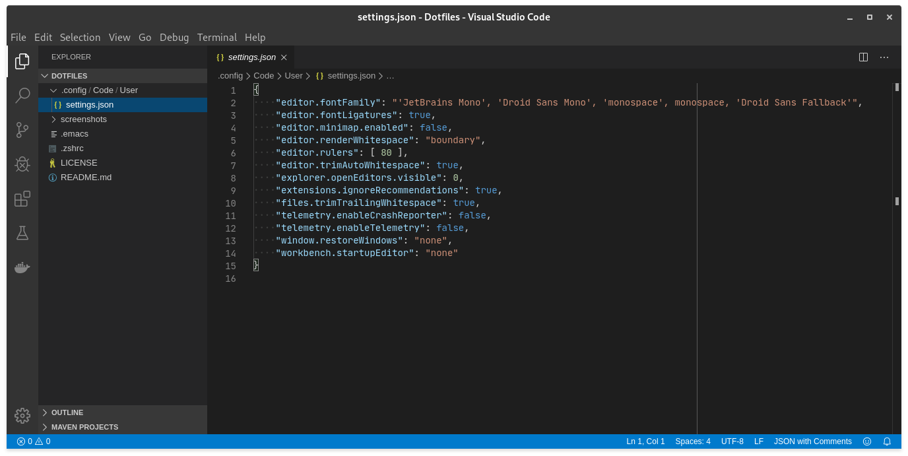
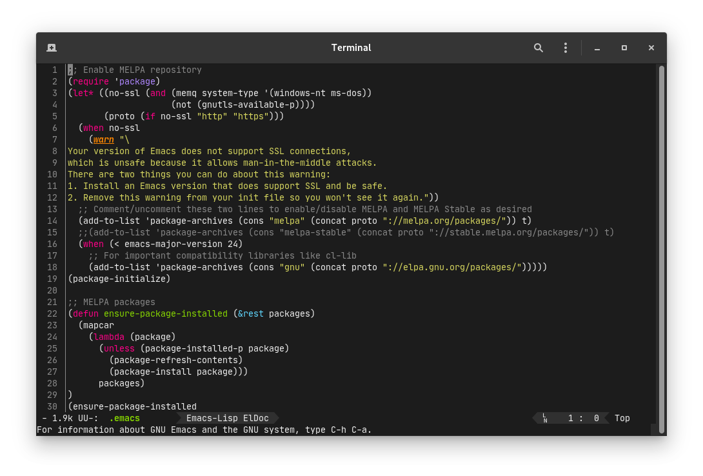
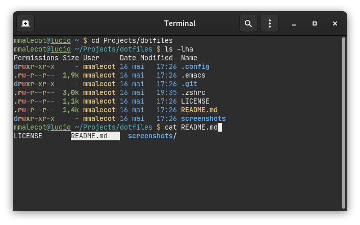

# Dotfiles

My dotfiles.

## Configurations

### Visual Studio Code

> [.config/Code/User/settings.json](.config/Code/User/settings.json)

* Enable [JetBrains Mono](https://www.jetbrains.com/lp/mono/) font with `ligatures`
* Disable `minimap`
* Render `whitespaces`
* Render vertical `ruler` after `80 characters`
* Remove trailing auto inserted `whitespace`
* Disable `multiple editors` in the Open Editors pane
* Disable notifications for `extension recommendations`
* Trim trailing `whitespace` when saving a file
* Disable `telemetry`
* Disable `windows restoration` after a restart
* Disable `startup editor`

### Emacs

> [.emacs](.emacs)

* Enable [MELPA](https://melpa.org/) repository
* Enable `monokai-theme`, `rust-mode`, `toml-mode`, `markdown-mode` and `powerline` packages
* Render `whitespaces`
* Use `spaces` instead of `tabs`
* Render `line number`
* Disable `menu bar`
* Show matching `pairs`
* Disable `backup files`
* Disable `auto save`

### Zsh

> [.zshrc](.zshrc)

* Define `ls` color setup
* Enable `completion`
* Custom `prompt`
* Limit `history size`
* Custom `aliases`
* Define `key bindings`
* Enable `colored man pages`

## License

This project is licensed under [MIT license](LICENSE).
